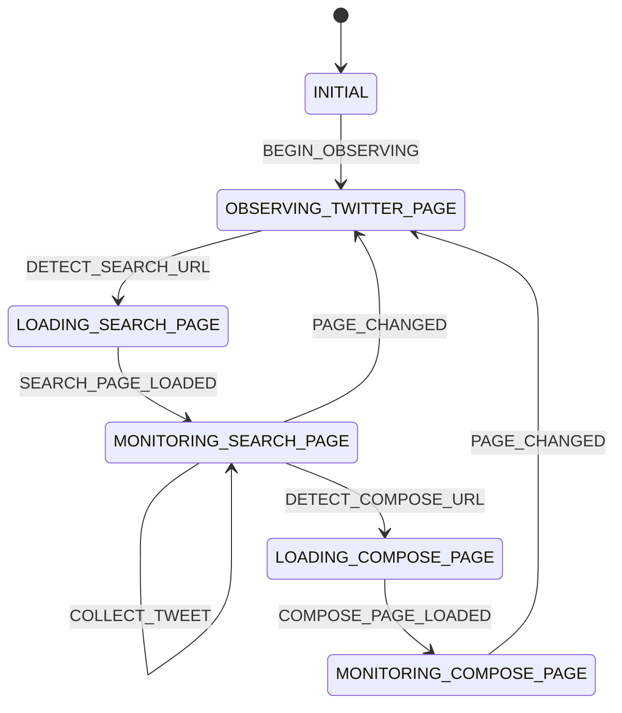

# アーキテクチャ

このドキュメントでは、KEEB_PD Result
Scraperの技術的アーキテクチャと設計決定について詳しく説明します。

## 目次

- [設計決定の理由](#設計決定の理由)
- [状態機械の仕様](#状態機械の仕様)
- [コアコンポーネント](#コアコンポーネント)
- [データフロー](#データフロー)
- [セキュリティ設計](#セキュリティ設計)

## 設計決定の理由

### なぜ状態機械パターンか

Twitter/XはSPA（シングルページアプリケーション）であり、複雑なナビゲーションパターンを持ちます。状態機械パターンを採用することで、以下の利点を得られます：

**利点**:

1. **明確な状態分離**:
   ページの状態（検索ページ、投稿ページ、その他）が明確に定義される
2. **予測可能な遷移**: 状態遷移のルールが明示的に定義され、デバッグが容易
3. **型安全性**: TypeScriptの型システムを活用し、無効な遷移をコンパイル時に検出
4. **クリーンアップの容易さ**:
   状態から離脱する際のクリーンアップロジック（Observer切断等）を一元管理

**代替案との比較**:

- **単純なフラグ管理**: 状態が増えると管理が複雑化し、バグが発生しやすい
- **イベントエミッター**: 遷移の制約を強制できず、予期しない状態に陥る可能性
- **Redux/Zustand等**: ユーザースクリプトには過剰な依存関係

### なぜMutationObserverか

Twitter/Xは動的にコンテンツを読み込むため、DOMの変更を検出する必要があります。

**MutationObserverの利点**:

1. **リアルタイム検出**: 新しいツイートがタイムラインに追加された瞬間に検出
2. **ページ遷移の検出**:
   SPAのナビゲーション（URLは変わらないがDOMが変わる）を検出
3. **低パフォーマンス影響**: 実際のDOM変更時のみ発火し、ポーリングより効率的
4. **標準ブラウザAPI**: 外部依存なし、全モダンブラウザで動作

**代替案との比較**:

- **setIntervalポーリング**: CPU使用率が高く、タイミングのずれが発生
- **Intersection Observer**:
  スクロール検出には有効だが、DOM構造変更は検出できない
- **イベントリスナー**: Twitter/Xの内部イベントに依存するため、変更に弱い

### なぜesbuild + Denoか

**esbuildの利点**:

- **高速ビルド**: Goで実装され、大規模プロジェクトでも数秒でバンドル
- **Tree-shaking**: 未使用コードを自動削除し、ファイルサイズを最小化
- **TypeScript対応**: 追加設定なしでTypeScriptをトランスパイル

**Denoの利点**:

- **依存関係管理不要**: `node_modules` がなく、URLベースのインポート
- **標準ツール内蔵**:
  フォーマッター（`deno fmt`）、リンター（`deno lint`）が標準搭載
- **セキュアデフォルト**:
  明示的な権限なしでファイルシステムやネットワークにアクセス不可

**@deno/esbuild-pluginの役割**:

- esbuildがDeno特有のインポート（JSR、npm、https）を解決できるようにする
- Deno公式プラグイン（`jsr:@deno/esbuild-plugin`）として提供され、安定性とメンテナンスが保証される
- `npm:esbuild` と組み合わせて高速なバンドルを実現

**代替案との比較**:

- **Webpack + Node.js**: 設定が複雑、ビルド時間が長い、`node_modules` が必要
- **Vite**: 開発サーバー中心で、単一ファイル出力（ユーザースクリプト）には不向き
- **Rollup**: esbuildより遅いが、プラグインエコシステムは豊富

## 状態機械の仕様

### 6つの状態

状態機械は以下の6つの状態を管理します：

```typescript
type State =
  | "INITIAL"
  | "OBSERVING_TWITTER_PAGE"
  | "LOADING_SEARCH_PAGE"
  | "MONITORING_SEARCH_PAGE"
  | "LOADING_COMPOSE_PAGE"
  | "MONITORING_COMPOSE_PAGE";
```

**状態の説明**:

1. **INITIAL**: スクリプト起動直後の初期状態
   - 何も監視していない
   - `BEGIN_OBSERVING` イベントで `OBSERVING_TWITTER_PAGE` に遷移

2. **OBSERVING_TWITTER_PAGE**: ページ全体を監視中
   - `twitterPageObserver` が動作中
   - URL変更やDOM読み込みを検出
   - 検索ページまたは投稿ページへの遷移を待つ

3. **LOADING_SEARCH_PAGE**: 検索ページのURL検出後、DOMが読み込まれるまで
   - KEEB_PD検索URLを検出した直後
   - タイムライン要素の読み込みを待つ
   - `SEARCH_PAGE_LOADED` で `MONITORING_SEARCH_PAGE` に遷移

4. **MONITORING_SEARCH_PAGE**: 検索ページのタイムラインを監視中
   - `searchTimelineObserver` が動作中
   - ツイートを自動収集し、`collectedTweets` Mapに追加
   - フローティングパネルが表示され、カウンターとTop 5いいね数ランキングを更新中
   - リツイートボタンにリスナーを追加（`UPDATE_TWEET_CONTEXT` 用）

5. **LOADING_COMPOSE_PAGE**: 投稿ページのURL検出後、DOMが読み込まれるまで
   - `/compose/post` URLを検出した直後
   - 送信ボタン等の要素読み込みを待つ
   - `COMPOSE_PAGE_LOADED` で `MONITORING_COMPOSE_PAGE` に遷移

6. **MONITORING_COMPOSE_PAGE**: 投稿ページでコピーボタンを表示中
   - 犬の絵文字（🐶）ボタンが表示されている
   - ボタンクリックで祝福メッセージをクリップボードにコピー

### 8つのイベントタイプ

状態遷移をトリガーするイベント：

```typescript
type StateEventType =
  | "BEGIN_OBSERVING"
  | "DETECT_SEARCH_URL"
  | "SEARCH_PAGE_LOADED"
  | "DETECT_COMPOSE_URL"
  | "COMPOSE_PAGE_LOADED"
  | "PAGE_CHANGED"
  | "UPDATE_TWEET_CONTEXT"
  | "COLLECT_TWEET";
```

**イベントの説明**:

1. **BEGIN_OBSERVING**: ページ監視開始（スクリプト起動時）
   - ペイロード: なし
   - 遷移: `INITIAL` → `OBSERVING_TWITTER_PAGE`

2. **DETECT_SEARCH_URL**: 検索URLを検出
   - ペイロード: `{ url: string }`
   - 条件: `isKEEBPDSearchURL(url)` が `true`
   - 遷移: `OBSERVING_TWITTER_PAGE` → `LOADING_SEARCH_PAGE`

3. **SEARCH_PAGE_LOADED**: 検索ページのDOM読み込み完了
   - ペイロード: `{ css_selector: string }`
   - 条件: `document.querySelector(css_selector)` が存在
   - 遷移: `LOADING_SEARCH_PAGE` → `MONITORING_SEARCH_PAGE`
   - 実行: `observeSearchTimeline` + `setupDownloadButton`

4. **DETECT_COMPOSE_URL**: 投稿ページURLを検出
   - ペイロード: `{ url: string }`
   - 条件: `url === "/compose/post"`
   - 遷移: `MONITORING_SEARCH_PAGE` → `LOADING_COMPOSE_PAGE`

5. **COMPOSE_PAGE_LOADED**: 投稿ページのDOM読み込み完了
   - ペイロード: `{ css_selector: string }`
   - 条件: `document.querySelector(css_selector)` が存在
   - 遷移: `LOADING_COMPOSE_PAGE` → `MONITORING_COMPOSE_PAGE`
   - 実行: `setupComposePage`（コピーボタン追加）

6. **PAGE_CHANGED**: 監視対象ページから離脱
   - ペイロード: `{ url: string }`
   - 条件: 現在のURLが監視対象でなくなった
   - 遷移: `MONITORING_SEARCH_PAGE` または `MONITORING_COMPOSE_PAGE` →
     `OBSERVING_TWITTER_PAGE`
   - 実行:
     - 検索ページからの離脱: `disconnectSearchTimeline` +
       `collectedTweets.clear()`
     - 投稿ページからの離脱: 離脱先が検索ページ以外の場合のみ
       `collectedTweets.clear()`

7. **UPDATE_TWEET_CONTEXT**: リツイートボタンクリックで選択ツイートを保存
   - ペイロード: `{ tweet: Tweet }`
   - 遷移: `MONITORING_SEARCH_PAGE` → `MONITORING_SEARCH_PAGE`（自己遷移）
   - 実行: `context.tweet = { ...event.tweet }`

8. **COLLECT_TWEET**: ツイートを自動収集（Map追加）
   - ペイロード: `{ tweet: Tweet }`
   - 遷移: `MONITORING_SEARCH_PAGE` → `MONITORING_SEARCH_PAGE`（自己遷移）
   - 実行: `context.collectedTweets.set(event.tweet.url, event.tweet)`

### 状態遷移図



## コアコンポーネント

### state-machine.ts

汎用状態機械の実装。プロジェクト固有の状態やイベントを型パラメータとして受け取ります。

**主要クラス: `StateMachine<StateContext>`**:

```typescript
class StateMachine<StateContext extends Record<string, unknown>> {
  private currentState: State;
  private listeners: Listener[] = [];
  private transitions: Transition<StateContext>[] = [];
  private context: StateContext;

  constructor(initialState: State, context: StateContext);

  // 遷移定義
  addTransition(transition: Transition<StateContext>): this;
  addTransitions(transitions: Transition<StateContext>[]): this;

  // 状態確認
  getState(): State;
  is(state: State): boolean;
  canHandle(eventType: StateEventType): boolean;
  canTransition(event: StateEvents): boolean;

  // イベント発火
  dispatch(event: StateEvents): boolean; // 失敗時はログ出力
  tryDispatch(event: StateEvents): boolean; // 失敗時は静か

  // リスナー管理
  addListener(listener: Listener): () => void;
  removeListener(listener: Listener): void;
  clearListeners(): void;
}
```

**Transition型**:

```typescript
type Transition<T> = {
  from: State; // 遷移元の状態
  to: State; // 遷移先の状態
  event?: StateEventType; // トリガーイベント
  condition?: (event: StateEvents) => boolean; // 遷移条件（省略可）
  execute?: (event: StateEvents, context: T) => void; // 遷移時の処理（省略可）
};
```

**設計原則**:

- `condition` は純粋関数（副作用なし、同じ入力→同じ出力）
- `execute` は同期処理のみ（非同期は禁止）
- コンテキストは `execute` 内でのみ変更可能

### tweet-parser.ts

ツイートDOM要素を解析し、構造化データを抽出します。

**主要関数**:

**1. `parseEntryTweet(node: Node): EntryTweetResult`**

ツイートノードから全メタデータを抽出します。

```typescript
type EntryTweetResult = {
  isEntryTweet: true;
  tweet: Tweet;
} | {
  isEntryTweet: false;
  reason: string;
};
```

**抽出プロセス**:

1. ノードの基本検証（HTMLDivElementか、`data-testid="cellInnerDiv"`か）
2. フィルタリング（`isPromotionTweet`、`isQuoteRetweet`）
3. いいね数の抽出（`button[data-testid="like"]` の子要素）
4. リツイート数の抽出（`button[data-testid="retweet"]` または `unretweet`）
5. ユーザー名の抽出（`div[data-testid="User-Name"]`、絵文字対応）
6. 日付とURLの抽出（`time` 要素の `datetime` 属性）
7. ラウンド番号の抽出（ツイート本文から正規表現 `/(?<=KEEB_PD_R)\d+/`）

**失敗理由の例**:

- `"node is not HTMLDivElement"`
- `"node is promotion tweet"`
- `"like element not found"`
- `"round information not found"`

**2. `isPromotionTweet(node: Node): boolean`**

プロモーションツイートを検出します。

**検出方法**:

- 特定のDOM構造内に `"プロモーション"` テキストが存在するか確認
- セレクタ: `article[data-testid="tweet"] > ... > span`

**3. `isQuoteRetweet(node: Node): boolean`**

引用リツイートを検出します。

**検出方法**:

- 引用元ツイートの `time` 要素が2つ存在するか確認
- セレクタ: `article > ... > div[tabindex="0"] > div time`

**4. `getTweetText(tweet: Tweet): string`**

祝福メッセージのテキストを生成します。

**出力例**:

```
#KEEB_PD_R1 で一番ふぁぼ(❤42)が多かったのは ユーザー名 さんでした🎉🎉🎉🎉
おめでとうございます!! 🎉🎉🎉🎉🎉🎉🎉
#KEEB_PD_R1 #KEEB_PD
```

### scriptbody.ts

アプリケーションのメインロジック。MutationObserverの設定、遷移ハンドラーの定義、状態機械の初期化を行います。

**StateContext型**:

```typescript
type StateContext = {
  searchTimelineObserver: MutationObserver; // 検索タイムライン監視用
  twitterPageObserver: MutationObserver; // ページ全体監視用
  listeners: number[]; // setIntervalのID管理
  tweet: Tweet; // 選択中のツイート（リツイートボタン経由）
  collectedTweets: Map<string, Tweet>; // 自動収集されたツイート（URLがキー）
};
```

**主要MutationObserver**:

**1. `twitterPageObserver`**

ページ全体を監視し、以下のイベントを発火します：

- `DETECT_SEARCH_URL`: URL変更を検出
- `SEARCH_PAGE_LOADED`: タイムライン要素の読み込み検出
- `DETECT_COMPOSE_URL`: 投稿ページへの遷移検出
- `COMPOSE_PAGE_LOADED`: 投稿ページ要素の読み込み検出
- `PAGE_CHANGED`: 監視対象ページからの離脱検出

**設定**:

```typescript
observer.observe(document, {
  subtree: true, // 全子孫要素を監視
  childList: true, // 子要素の追加/削除を検出
});
```

**2. `searchTimelineObserver`**

検索タイムラインを監視し、新しいツイートを検出します。

**処理フロー**:

1. `addedNodes` から `data-testid="cellInnerDiv"` を抽出
2. プロモーションツイートと引用リツイートを除外
3. 残ったノードを `parseEntryTweet` で解析
4. 解析成功時:
   - `COLLECT_TWEET` イベントで自動収集
   - リツイートボタンにクリックリスナーを追加（`UPDATE_TWEET_CONTEXT` 用）

**主要Execute Handler**:

**1. `observeTwitterPage`**

`twitterPageObserver` を開始します。

**2. `observeSearchTimeline`**

`searchTimelineObserver` を開始します。

**3. `disconnectSearchTimeline`**

検索ページから離脱時のクリーンアップ：

- `searchTimelineObserver.disconnect()`: Observer停止
- フローティングパネルの削除
- `setInterval` のクリア
- `context.collectedTweets.clear()`: 収集したツイートデータをクリア（v1.x以降）

**実装箇所**: scriptbody.ts:380-383（遷移定義内）

**4. `setupDownloadButton`**

フローティングコントロールパネルを作成・表示します。

**パネル構成**:

- カウンターバッジ: `context.collectedTweets.size` をリアルタイム表示
- ダウンロードボタン: JSON生成 → Blob → ダウンロード
- クリアボタン: `confirm()` 確認後、`collectedTweets.clear()`

**5. `setupComposePage`**

投稿ページにコピーボタン（🐶）を追加します。

**ボタン動作**:

- クリックで `navigator.clipboard.writeText(text)` 実行
- `context.tweet` から祝福メッセージを生成

## データフロー

### ページ読み込みから自動収集まで

```
1. ユーザーがTwitter/Xを開く
   ↓
2. スクリプト起動: stateMachine.dispatch({ type: "BEGIN_OBSERVING" })
   ↓
3. INITIAL → OBSERVING_TWITTER_PAGE
   ↓
4. twitterPageObserver.observe(document, ...) 開始
   ↓
5. ユーザーがKEEB_PD検索URLに移動
   ↓
6. MutationObserver発火 → stateMachine.tryDispatch({ type: "DETECT_SEARCH_URL", url: ... })
   ↓
7. OBSERVING_TWITTER_PAGE → LOADING_SEARCH_PAGE
   ↓
8. タイムライン要素がDOMに追加される
   ↓
9. MutationObserver発火 → stateMachine.tryDispatch({ type: "SEARCH_PAGE_LOADED", css_selector: ... })
   ↓
10. LOADING_SEARCH_PAGE → MONITORING_SEARCH_PAGE
    ↓
11. observeSearchTimeline() + setupDownloadButton() 実行
    ↓
12. searchTimelineObserver.observe(document, ...) 開始
    ↓
13. フローティングパネル表示、カウンター更新開始（setInterval）
    ↓
14. ユーザーがスクロール → 新しいツイートがDOMに追加
    ↓
15. searchTimelineObserver発火 → ツイートノードをフィルタリング
    ↓
16. parseEntryTweet(node) で解析
    ↓
17. 解析成功 → stateMachine.dispatch({ type: "COLLECT_TWEET", tweet: ... })
    ↓
18. context.collectedTweets.set(tweet.url, tweet) に追加
    ↓
19. カウンター更新（次のsetIntervalで反映）
    ↓
20. ユーザーがダウンロードボタンをクリック
    ↓
21. Array.from(context.collectedTweets.values()) → JSON.stringify() → Blobダウンロード
```

### リツイートボタン連携フロー

```
1. ユーザーが検索ページでリツイートボタンをクリック
   ↓
2. リスナー発火: stateMachine.dispatch({ type: "UPDATE_TWEET_CONTEXT", tweet: ... })
   ↓
3. context.tweet = { ...event.tweet } に保存
   ↓
4. ユーザーが投稿ページ（/compose/post）に移動
   ↓
5. twitterPageObserver発火 → stateMachine.tryDispatch({ type: "DETECT_COMPOSE_URL", ... })
   ↓
6. MONITORING_SEARCH_PAGE → LOADING_COMPOSE_PAGE
   ↓
7. 送信ボタン等がDOMに追加される
   ↓
8. twitterPageObserver発火 → stateMachine.tryDispatch({ type: "COMPOSE_PAGE_LOADED", ... })
   ↓
9. LOADING_COMPOSE_PAGE → MONITORING_COMPOSE_PAGE
   ↓
10. setupComposePage() 実行: コピーボタン（🐶）追加
    ↓
11. ユーザーが🐶ボタンをクリック
    ↓
12. getTweetText(context.tweet) で祝福メッセージ生成
    ↓
13. navigator.clipboard.writeText(text) でクリップボードにコピー
```

## データライフサイクル管理

### 収集ツイートデータの管理

収集したツイートデータ（`context.collectedTweets`）は以下のライフサイクルで管理されます。

**データ構造**:

```typescript
collectedTweets: Map<string, Tweet>;
```

- **キー**: ツイートのURLパス（重複排除用）
- **値**: Tweetオブジェクト（メタデータ）

**データの追加**:

- `COLLECT_TWEET` イベント発火時（検索ページでの自動収集）
- `Map.set()` で追加（既存キーの場合は上書き）

**データのクリア**:

1. **検索ページ離脱時**（自動）:
   - トリガー: `MONITORING_SEARCH_PAGE` →
     `OBSERVING_TWITTER_PAGE`（`PAGE_CHANGED`）
   - 条件: 離脱先がKEEB_PD検索URL以外
   - 処理: `context.collectedTweets.clear()`
   - 実装: scriptbody.ts:380-383

2. **投稿ページ離脱時**（条件付き自動）:

   **パターンA: 検索ページへ戻る**:
   - トリガー: `MONITORING_COMPOSE_PAGE` →
     `MONITORING_SEARCH_PAGE`（`PAGE_CHANGED`）
   - 条件: 離脱先がKEEB_PD検索URL
   - 処理: データを保持（クリアしない）
   - 実装: scriptbody.ts:534-541

   **パターンB: その他のページへ移動**:
   - トリガー: `MONITORING_COMPOSE_PAGE` →
     `OBSERVING_TWITTER_PAGE`（`PAGE_CHANGED`）
   - 条件: 離脱先が検索URL以外かつ投稿ページ以外
   - 処理: `context.collectedTweets.clear()`
   - 実装: scriptbody.ts:542-558

3. **ユーザー操作**（手動）:
   - トリガー: フローティングパネルの「🗑 Clear All」ボタンをクリック
   - 確認: `confirm()` ダイアログで確認
   - 処理: `context.collectedTweets.clear()`

**設計理念**:

この自動クリア機能により、以下を実現します：

- **データ混在の防止**: 異なるラウンドや検索条件のツイートが混ざらない
- **ワークフロー保持**: 検索ページ ↔
  投稿ページ間ではデータを保持し、リツイートボタン連携が機能する
- **メモリ管理**:
  不要になったデータを自動的に解放し、長時間使用時のメモリリークを防ぐ

**フロー図**:

```
KEEB_PD検索ページ (R1)
  ├─ ツイート収集 → collectedTweets に追加
  ├─ 投稿ページに移動 → データ保持 ✓
  │   └─ 検索ページに戻る → データ保持 ✓
  ├─ ホームに移動 → データクリア ✓
  └─ 別の検索ページ (R2) に移動 → データクリア ✓

投稿ページ
  ├─ 検索ページに戻る → データ保持 ✓
  └─ ホームに移動 → データクリア ✓
```

## セキュリティ設計

### セキュリティ原則

このユーザースクリプトは以下の原則に従い、安全性を確保しています。

**1. 外部通信なし**

- **実装**: `fetch()`、`XMLHttpRequest`、`WebSocket`
  等のネットワークAPIを一切使用しない
- **検証方法**: ブラウザのDevTools → Networkタブで通信を確認
- **理由**: 収集したツイートデータを外部サーバーに送信しないことを保証

**2. ローカル処理のみ**

- **実装**: 全ての処理（解析、フィルタリング、JSON生成）はブラウザ内で完結
- **データ保存**: `collectedTweets` Mapは揮発性（ページリロードで消去）
- **永続化なし**: `localStorage`、`IndexedDB`、`sessionStorage` を使用しない

**3. クリップボード書き込みはユーザー操作必須**

- **実装**: `navigator.clipboard.writeText()` は明示的なボタンクリック時のみ実行
- **コード位置**: scriptbody.ts:74-80（`setupComposePage` 内）
- **理由**: ユーザーの意図しないクリップボード操作を防止

**4. 読み取り専用操作**

- **実装**: ツイート内容やユーザーデータを変更するDOM操作なし
- **許可される操作**:
  - ツイートメタデータの読み取り（`querySelector`、`textContent`）
  - UI要素の追加（フローティングパネル、コピーボタン）
- **禁止される操作**:
  - ツイート本文の編集
  - いいね・リツイートの自動実行
  - ユーザー情報の変更

**5. コード実行の制限**

- **実装**: `eval()`、`Function()` コンストラクタ、`innerHTML`
  による動的コード実行を禁止
- **許可される方法**: `textContent`、`createElement`、`appendChild` のみ
- **理由**: XSS（クロスサイトスクリプティング）攻撃のリスクを排除

### 依存関係のセキュリティ

**ビルド時依存**:

- `esbuild`: OpenJS Foundation公式プロジェクト、広く使用されている
- `deno-loader`: Deno公式のesbuildローダー

**ランタイム依存**:

- **なし**:
  最終的なユーザースクリプト（`out/script.js`）は全て静的にバンドルされ、外部依存なし

**検証方法**:

- `out/script.js` を開き、`fetch`、`XMLHttpRequest`、`eval`
  等の危険なAPIが含まれていないことを確認
- ブラウザのDevToolsでネットワークタブを監視し、外部通信がないことを確認

### プライバシー保護

**収集データ**:

- ツイートのメタデータのみ（公開情報）
- 収集範囲: ユーザーが閲覧した検索結果ページのみ

**収集しないデータ**:

- ユーザーの閲覧履歴
- ログイン情報やクッキー
- DMや非公開ツイート

**データの扱い**:

- ブラウザのメモリ内にのみ保持（`Map<string, Tweet>`）
- ユーザーが明示的にダウンロードボタンを押した場合のみ、ローカルファイルとして保存
- 外部送信なし

### コードレビュー推奨事項

ユーザーがスクリプトをインストールする前に、以下を確認することを推奨します：

1. **`out/script.js` の確認**:
   - ファイルサイズが異常に大きくないか（通常は10-20KB程度）
   - 難読化されていないか（読みやすいコードであるべき）
   - 外部URLが含まれていないか（`https://` で検索）

2. **ネットワークタブの監視**:
   - スクリプト実行中、DevToolsのNetworkタブで外部通信がないことを確認

3. **コンソールログの確認**:
   - 状態遷移ログが正常か確認
   - エラーやwarningがないか確認

4. **ソースコード確認**:
   - このリポジトリのソースコード（`src/`）を確認し、意図しない処理がないか確認
   - ビルドプロセス（`builder.ts`）を確認し、追加の処理が含まれていないか確認
